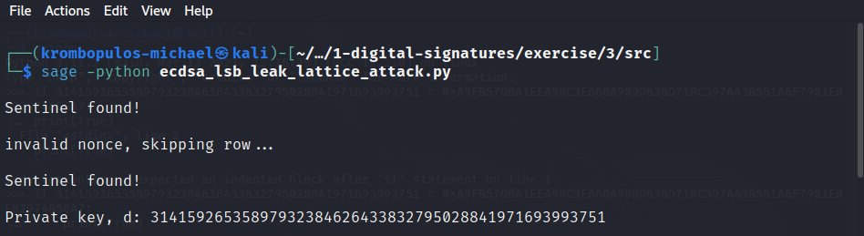
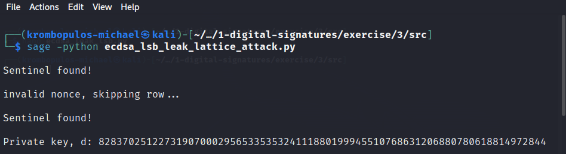

# Exercise 3 - ECDSA: Lattice Basis Reduction Attack with nonce LSBs leak

## Table of contents


- [Instructions](#instructions)
- [Analysis](#analysis)
- [Elliptic Curve Digital Signature Algorithm (ECDSA)](#elliptic-curve-digital-signature-algorithm-ecdsa)
    - [Domain Parameter Selection](#domain-parameter-selection)
    - [Private Key](#private-key)
    - [Signing](#signing)
- [ECDSA Lattice Basis Reduction Attack](#ecdsa-lattice-basis-reduction-attack)
- [Implementation](#implementation)
- [References](#references)

## Instructions

*Given* a python script `ecdsa_leak_lsb.py` and `output.txt`,
*the goal* is to recover the ECDSA private key `d`.

Hint: Use the template of the solution that was presented in the class (i.e. `lattice_solve.py`).

## Analysis

In this section we will analyze this exercise's
requirements, taking into account the provided scripts,
and any relative theoretical concepts that will help in producing a solution.

### Elliptic Curve Digital Signature Algorithm (ECDSA)

The
[Elliptic Curve Digital Signature Algorithm (ECDSA)](https://en.wikipedia.org/wiki/Elliptic_Curve_Digital_Signature_Algorithm)
is an algorithm for performing digital signatures that uses elliptic curve cryptography.

#### Domain Parameter Selection

Before anything else, in ECDSA, the parties involved must agree on the ECDSA Domain Parameters.
According to [RFC 5639, Section 3](https://www.rfc-editor.org/rfc/rfc5639#section-3)
the domain parameters to be specified are:

-   For all curves, an ID is given by which it can be referenced.

-   `p` is the prime specifying the base field.

-   `A` and `B` are the coefficients of the equation
    $y^2 = x^3 + A \cdot x + B \mod{p}$
    defining the elliptic curve.

-   `G = (x, y)` is the base point, i.e., a point in `E` of prime order,
    with `x` and `y` being its x- and y-coordinates, respectively.

-   `q` is the prime order of the group generated by `G`.

Examining the provided python script `ecdsa_leak_lsb.py`,
we can see that in our case the Curve-ID is brainpoolP256r1
[RFC 5639, Section 3.4](https://www.rfc-editor.org/rfc/rfc5639#section-3.4).
So in our implementation for the solution
we will need to include the following code
(as it is also included in `ecdsa_leak_lsb.py`)
in order to define the Domain Parameters:

```python
# Domain Parameter Definition
# Curve-ID: brainpoolP256r1

# the prime specifying the base field
p = 0xA9FB57DBA1EEA9BC3E660A909D838D726E3BF623D52620282013481D1F6E5377

# the coefficients of the equation defining the elliptic curve
A = 0x7D5A0975FC2C3057EEF67530417AFFE7FB8055C126DC5C6CE94A4B44F330B5D9
B = 0x26DC5C6CE94A4B44F330B5D9BBD77CBF958416295CF7E1CE6BCCDC18FF8C07B6

# the base points' x- and y-coordinates, respectively.
x = 0x8BD2AEB9CB7E57CB2C4B482FFC81B7AFB9DE27E1E3BD23C23A4453BD9ACE3262
y = 0x547EF835C3DAC4FD97F8461A14611DC9C27745132DED8E545C1D54C72F046997

# the prime order of the group generated by the base point `G`
q = 0xA9FB57DBA1EEA9BC3E660A909D838D718C397AA3B561A6F7901E0E82974856A7
```

**Note**:
We have changed the variable name in the provided script `ecdsa_leak_lsb.py`,
so that they match the ones in
[RFC 5639, Section 3.4](https://www.rfc-editor.org/rfc/rfc5639#section-3.4).

#### Private Key

After parameter specification, the provided script, `ecdsa_leak_lsb.py`,
picks a private key `d` at random from the set $\{1, ..., q - 1\}$,

```python
d = randint(1, q - 1)
```

#### Signing

Then, the script proceeds to construct a list of messages `msgs`.
This list contains 4 messages, each one repeated 4 times,
totalling in 16 messages.

```python
msgs = [
  b'Consulted perpetual of pronounce me delivered',
  b'Too months nay end change relied who beauty wishes matter',
  b'Shew of john real park so rest we on',
  b'Can you recover d?!']*4
```

For each message `msg` from the `msgs` list,
the standard ECDSA signing procedure is executed as follows:

1. The hash , $h$, of the message is calculated (using SHA-256).
2. The nonce, $k$, is randomly selected from $\{1, ..., q - 1\}$
3. The $x$-coordinate of the curve point $k \cdot G$ is assigned to $r$ ($\mod{q}$)
4. The value $s = k^{-1} \cdot (h + r \cdot d) \mod{q}$ is calculated

Lastly, the message's hash, `h`, and its resulting signature `(r, s)`
are added as an entry to a list of signatures `S`.
But there's a catch! 🙀
along with the signature the 30 least significant bits of the nonce `k`
are also added as a `leak`. 😈
The above procedure is implemented in `ecdsa_leak_lsb.py`
as shown in the following snippet:

```python
S = []
for msg in msgs:
  h = bytes_to_long( sha256(msg).digest() )
  k = randint(1, q - 1)
  r = int( (k * G)[0] )
  s = int( pow(k, -1, q) * (h + d * r) % q )
  S.append( { 'h': h, 'r': r, 's': s, 'leak': k % 2**30 } )

```

Now that we know exactly what the provided `ecdsa_leak_lsb.py`
does, and hence we know the exact format of the `output.txt` file,
we can start figuring out how to recover the private key `d`.

### ECDSA Lattice Basis Reduction Attack

The following, is a an exploration of the reasoning
behind the ECDSA Lattice Basis Reduction Attack,
specifically in the case of least significant bits
leaks of the nonce.

Most of this section will essentially be
a reformulation of the content in the referenced sources
in a simplified more suitable for our case way
that will lead to a method to solve the problem.

As mentioned above, we have the available signatures
$(h_i, r_i, s_i, {leak}_i)$, for $i=1,...,m$.

Solving the expression used in the calculation of the signature value $s_i$,
with respect to the private key $d$, we get:

$$s_i \equiv k_i^{-1}(h_i + r_i \cdot d) \pmod{q}$$

$$\Leftrightarrow d \equiv r_i^{-1} \cdot (s_i \cdot k_i - h_i) \pmod{q}$$

So, full knowledge of a single nonce would reveal the private key.
But we don't know any nonce $k_i$ in full,
we do know however the $l$ least significant bits in the ${leak}_i$.

So we can write out an expression for the nonce that uses this knowledge:

$$k_i = 2^l \cdot b_i + {leak}_i$$

Now we only need to find a $b_i$ coefficient.
Substituting in the expression for $s_i$, we get:

$$s_i \equiv k_i^{-1}(h_i + r_i \cdot d) \pmod{q}$$

$$\Leftrightarrow s_i \cdot (2^l \cdot b_i + {leak}_i) \equiv h_i + r_i \cdot d \pmod{q}$$

$$\Leftrightarrow b_i \equiv (2^l \cdot s_i)^{-1} \cdot r_i \cdot d + (2^l \cdot s_i)^{-1} \cdot (h_i - s_i \cdot {leak}_i) \pmod{q}$$

Using the following substitutions in the last expression

-   $t_i = (2^l \cdot s_i)^{-1} \cdot r_i$
-   $u_i = (2^l \cdot s_i)^{-1} \cdot (h_i - s_i \cdot {leak}_i)$

we get

$$b_i \equiv t_i \cdot d + u_i \pmod{q}$$

that implies that there are integers $c_1, ..., c_m$,
that will satisfy the following relations:

$$b_i = c_i \cdot q + t_i \cdot d - u_i, \ i = 1,...,m$$

The above relations form a system of linear equations,
that can be expressed using matrix multiplication,
with the help of the lattice basis $B$

$$ B = \begin{bmatrix}
    q && 0 && \ldots && 0 && 0 && 0 \\
    0 && q && \ldots && 0 && 0 && 0 \\
    \vdots && \vdots && \ddots && \vdots && \vdots && \vdots \\
    0 && 0 && \ldots && q && 0 && 0 \\
    t_1 && t_2 && \ldots && t_m && 1/2^l && 0 \\
    u_1 && u_2 && \ldots && u_m && 0 && q/2^l \\
\end{bmatrix} \in \mathbb{Q}^{(m + 2) \times (m + 2)}$$

like so

$$\begin{bmatrix}
    c_1 \\ c_2 \\ \vdots \\ c_m \\ d \\ -1
\end{bmatrix} ^ T \cdot B = \begin{bmatrix}
    c_1 \cdot q + t_1 \cdot d - u_1 \\
    c_2 \cdot q + t_2 \cdot d - u_2 \\
    \vdots \\
    c_m \cdot q + t_m \cdot d - u_m \\
    d/2^l \\
    -q/2^l
\end{bmatrix} ^ T = \begin{bmatrix}
    b_1 \\
    b_2 \\
    \vdots \\
    b_m \\
    d/2^l \\
    -q/2^l
\end{bmatrix} ^ T$$

This means that the lattice spanned by the basis $B$
contains a vector that contains the target values
$b_1, ..., b_m$.

By applying the
[Lenstra–Lenstra–Lovász (LLL) lattice basis reduction algorithm](https://en.wikipedia.org/wiki/Lenstra%E2%80%93Lenstra%E2%80%93Lov%C3%A1sz_lattice_basis_reduction_algorithm)
on the lattice basis $B$,
the resulting reduced basis $R$ for the lattice,
will likely contain the vector:

$$\begin{bmatrix}
    b_1 &&
    b_2 &&
    \ldots &&
    b_m &&
    d/2^l &&
    -q/2^l
\end{bmatrix}$$

Afterwhich,
we can find the row corresponding to this vector
by looking for the element $-q/2^l$.

Then, we'll be able to use the equation
$$k_i = 2^l \cdot b_i + {leak}_i$$
to calculate the nonce.

Finally, using the relation
$$d \equiv r_i^{-1} \cdot (s_i \cdot k_i - h_i) \pmod{q}$$
we can recover the private key.

## Implementation

You can find our implementation in `src/ecdsa_lsb_leak_lattice_attack.py` file.

We will be using [SageMath](https://www.sagemath.org/)
due to its capabilities in manipulating vectors and matrices,
as well as for elliptic curve operations.

We'll also use `ast`
to read the `output.txt` file produced by the `ecdsa_leak_lsb.py` script.

So, we start by importing the necessary libraries

```python
from sage.all_cmdline import *
import ast
```

Using `ast` we read the signatures list in the `output.txt` file,
and assign the list to the variable `S`.

```python
# Read signatures from `output.txt`

with open("output.txt", "r") as file:
    contents = file.read()

S = ast.literal_eval(contents)
```

Next, we specify the domain parameters,
and create the elliptic curve instance `E`,
and the base point `G`.

```python
# Domain Parameter Definition
# Curve-ID: brainpoolP256r1

# the prime specifying the base field
p = 0xA9FB57DBA1EEA9BC3E660A909D838D726E3BF623D52620282013481D1F6E5377

# the coefficients of the equation defining the elliptic curve
A = 0x7D5A0975FC2C3057EEF67530417AFFE7FB8055C126DC5C6CE94A4B44F330B5D9
B = 0x26DC5C6CE94A4B44F330B5D9BBD77CBF958416295CF7E1CE6BCCDC18FF8C07B6

# the base point's x- and y-coordinates, respectively.
x = 0x8BD2AEB9CB7E57CB2C4B482FFC81B7AFB9DE27E1E3BD23C23A4453BD9ACE3262
y = 0x547EF835C3DAC4FD97F8461A14611DC9C27745132DED8E545C1D54C72F046997

# the prime order of the group generated by the base point `G`
q = 0xA9FB57DBA1EEA9BC3E660A909D838D718C397AA3B561A6F7901E0E82974856A7

E = EllipticCurve(GF(p), [A, B])
G = E(x, y)
```

Now, we define a function that will construct the lattice basis matrix,
described in the [previous section](#ecdsa-lattice-basis-reduction-attack).

```python
def construct_lattice_basis(S, q, l):
    # Set the number of available signatures
    m = len(S)

    # Start by constructing an identity matrix multiplied by `q`
    B = q * matrix.identity(m)

    # Construct the `t` row
    t = []
    for i in range(m):
        t.append(Integer(pow(2**l * S[i]["s"], -1, q) * S[i]["r"]))

    # Add `t` to the basis `B` as its `m + 1`-th row
    B = B.insert_row(m, t)

    # Construct the `u` row,
    u = []
    for i in range(m):
        u.append(
            Integer(
                pow(2**l * S[i]["s"], -1, q) *
                (S[i]["h"] - S[i]["s"] * S[i]["leak"])
            )
        )

    # Add `u` to the basis `B` as its `m + 2`-th row
    B = B.insert_row(m + 1, u)

    # Augment `B` with the vector `[0, 0, ..., 1 / 2^l, 0]`,
    # and then with the vector `[0, 0, ..., 0, -q / 2^l]`

    B = B.change_ring(QQ)  # Change basis' ring to irrational

    v = vector([0] * m + [1 / 2**l] + [0])
    B = B.augment(v)

    w = vector([0] * (m + 1) + [-q / 2**l])
    B = B.augment(w)

    return B
```

Next, we set the number of leaked least significant bits per nonce `l`,
then we construct our initial lattice basis `B`,
and apply the Lenstra–Lenstra–Lovász (LLL) lattice basis reduction algorithm
which returns the reduced lattice basis `R`.

```python
l = 30  # the number of leaked least significant bits per nonce

# Construct the lattice basis `B`
B = construct_lattice_basis(S, q, l)

# Apply the Lenstra–Lenstra–Lovász (LLL)
# lattice basis reduction algorithm on the lattice basis `B`,
# to obtain the resulting reduced basis `R` for the lattice
R = B.LLL()
```

We expect that the reduced basis `R` will contain the vector

$$\begin{bmatrix}
    b_1 &&
    b_2 &&
    \ldots &&
    b_m &&
    d/2^l &&
    -q/2^l
\end{bmatrix}$$

as one of its rows. We can find this row by checking for the value $-q/2^l$.
Thus, we iterate over the rows of the reduced basis `R`,
while checking if the current row contains the sentinel value $-q/2^l$.
If we find a row that contains the sentinel value,
we calculate the current nonce as $k_i = 2^l \cdot b_i + {leak}_i$.
Then, we try validating the nonce
by checking if the $x$-coordinate of the curve point $k\cdot G$
equals the corresponding $r$ value. If it doesn’t, we skip it, and
if it does we proceed to recover the private key using the relation
$d \equiv r_i^{-1} \cdot (s_i \cdot k_i - h_i) \pmod{q}$.

```python
# Find the row with the sentinel element `- q / 2^l`

sentinel = -q / 2**l

for i, row in enumerate(R):
    if sentinel in row:
        print("\nSentinel found!\n")

        b = Integer(row[i])

        # Calculate the nonce `k`
        k = 2**l * b + S[i]["leak"]

        # Validating the nonce, by checking
        # if `k * G`'s x-coordinate equals the corresponding `r` value
        if (k * G)[0] != S[i]["r"]:
            print("invalid nonce, skipping row...")
            continue

        # Recover the private key `d`
        d = pow(S[i]["r"], -1, q) * (S[i]["s"] * k - S[i]["h"]) % q

        print(f"Private key, d: {d}\n")
```

To be able to easily tell whether we got it right,
let's change slightly the `ecdsa_leak_lsb.py`,
and set the key to the first digits of pi (or $π$).

```python
# d = randint(1, q - 1)
d = 31415926535897932384626433832795028841971693993751  # smaller than q
```

We will run the script `ecdsa_leak_lsb.py` to get the updated signature list,
and run the script `ecdsa_lsb_leak_lattice_attack.py` to recover the private key. As shown in the following screenshot, we did recover the private key successfully.



Now, we'll run our script, `ecdsa_lsb_leak_lattice_attack.py`,
for the provided `output.txt` file:



So, that’s it! the recovered private key 🔑 is:

```bash
828370251227319070002956533535324111880199945510768631206880780618814972844
```

## References

-   University of Piraeus 🦆 - Mobile and Wireless Communications Security 🔐

-   [Elliptic-curve cryptography, From Wikipedia, the free encyclopedia](https://en.wikipedia.org/wiki/Elliptic-curve_cryptography)

-   [Elliptic Curve Digital Signature Algorithm, From Wikipedia, the free encyclopedia](https://en.wikipedia.org/wiki/Elliptic_Curve_Digital_Signature_Algorithm)

-   [Elliptic Curve Cryptography: a gentle introduction, Andrea Corbellini](https://andrea.corbellini.name/2015/05/17/elliptic-curve-cryptography-a-gentle-introduction/)

-   [RFC 5639: Elliptic Curve Cryptography (ECC) Brainpool Standard Curves and Curve Generation](https://www.rfc-editor.org/rfc/rfc5639)

-   [Lenstra–Lenstra–Lovász (LLL) lattice basis reduction algorithm, From Wikipedia, the free encyclopedia](https://en.wikipedia.org/wiki/Lenstra%E2%80%93Lenstra%E2%80%93Lov%C3%A1sz_lattice_basis_reduction_algorithm)

-   [the cryptopals crypto challenges - Crypto Challenge Set 8 : 62. Key-Recovery Attacks on ECDSA with Biased Nonces](https://cryptopals.com/sets/8/challenges/62.txt)

-   [Lattice Attacks on ECDSA - Vac](https://forum.vac.dev/t/lattice-attacks-on-ecdsa/136)

-   [Guessing Bits: Improved Lattice Attacks on (EC)DSA with Nonce Leakage, Chao Sun, Thomas Espitau, Mehdi Tibouchi, and Masayuki Abe](https://eprint.iacr.org/2021/455.pdf)

-   [Biased Nonce Sense: Lattice Attacks against Weak ECDSA Signatures in Cryptocurrencies, Joachim Breitner, Nadia Heninger](https://eprint.iacr.org/2019/023.pdf)
